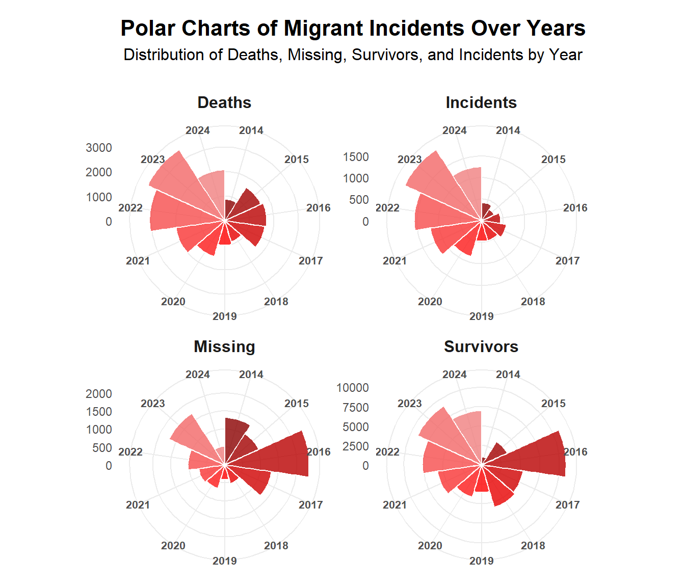
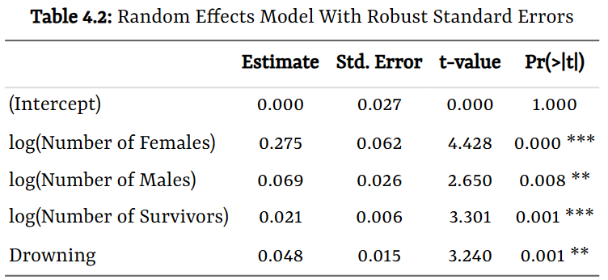

# 🌍 Between Borders: An Econometric Analysis of Migrant Child Deaths & Disappearances 📊

  

    <!-- Project Links -->
    

## 📝 Description

This project provides an in-depth **econometric panel data analysis** to investigate the factors influencing the deaths and disappearances of migrant children worldwide. Using a decade of data, we explore the temporal and spatial patterns of these tragic events and build a statistical model to identify key predictors, with the ultimate goal of informing policy and humanitarian interventions.

## ✨ Objective

The primary research question driving this project is:
> **What are the factors that influence the total number of deaths and missing children in migrant incidents across continents and time?**

To answer this, our objectives were to:
*   Analyze the temporal and spatial distribution of migrant incidents.
*   Specify and estimate an appropriate panel data regression model.
*   Identify significant predictors of child deaths and disappearances.
*   Provide data-driven insights to support policy interventions aimed at protecting vulnerable populations.

## 🎓 Project Context

This project was developed for the **Statistics for Data Science** course in the **[Master's in Data Science and Advanced Analytics](https://www.novaims.unl.pt/en/education/programs/postgraduate-programs-and-master-degree-programs/master-degree-program-in-data-science-and-advanced-analytics-with-a-specialization-in-data-science/)** program at **NOVA IMS**. The work was completed during the **1st Semester** of the **2024/2025** academic year.

## 💾 Data Source

The data was sourced from the **[Missing Migrants Project](https://missingmigrants.iom.int/data)**, an initiative by the **International Organization for Migration (IOM)**.

*   **Dataset:** Contains **5,462 entries** of migrant incidents from **2014 to 2024**.
*   **Scope:** The dataset includes detailed information on incident dates, locations, and the number of deceased, missing, and surviving individuals, including gender breakdowns.

    

## 🛠️ Technologies Used

The analysis and visualization for this project were conducted entirely within the **R** ecosystem.

    
    
    
     

---

## ⚙️ Methodology & Analytical Workflow

Our approach followed a structured econometric analysis process:

1.  **Data Preprocessing:**
    *   Filtered the dataset for high-quality source information.
    *   Transformed variables using **logarithmic transformations** to handle non-normal distributions and created **dummy variables** for categorical features like `Cause of Death`.

2.  **Initial Analysis & Visualization:**
    *   Illustrated temporal trends using **polar charts** and geospatial patterns with an **animated global map**, identifying the Mediterranean Sea and Central America as critical high-risk zones.

    

      
    

3.  **Econometric Modeling:**
    *   **Model Selection:** We employed **Panel Data Regression** to control for both time and continent-specific effects. We compared **Pooled OLS**, **Fixed Effects (FE)**, and **Random Effects (RE)** models.
    *   **Specification Tests:**
        *   **Breusch-Pagan Test:** Confirmed the presence of **heteroskedasticity** (p-value < 0.05), necessitating the use of robust standard errors.
        *   **Robust Hausman Test:** Yielded a p-value of 0.929, indicating that both Fixed and Random Effects models are consistent, but the **Random Effects model is more efficient**. This model was chosen for the final analysis.

---

## 📈 Results & Key Findings

The **Robust Random Effects model** revealed several significant factors influencing the number of child deaths and disappearances (D&M):

  

*   **Impact of Female Fatalities:** Both `log(Number of Females)` and `log(Number of Males)` showed positive and significant coefficients. However, the coefficient for female D&M (**0.275**) is substantially larger than for male D&M (**0.069**). This suggests a 1% increase in female deaths is associated with a **0.275% increase** in child deaths, highlighting the critical role of women as primary caregivers.
*   **Risk of Drowning:** The `Drowning` dummy variable was positive and significant, indicating that drowning incidents are associated with an **approximately 4.92% increase** in the expected number of child D&M compared to other causes of death.

## 🏁 Conclusion & Next Steps

Our analysis confirms that migrant deaths and disappearances are concentrated in high-risk regions and that the vulnerability of women is directly linked to an increased risk for children.

**Future Research Directions:**
*   Incorporate data on smuggling networks and conflict levels in countries of origin.
*   Conduct a more granular analysis of specific migration routes to guide localized interventions.
*   Advocate for improved data standardization across regions to enable more accurate and comprehensive crisis assessment.

## 👥 Team Members

*   **André Silvestre** (20240502)
*   **Filipa Pereira** (20240509)
*   **Umeima Mahomed** (20240543)