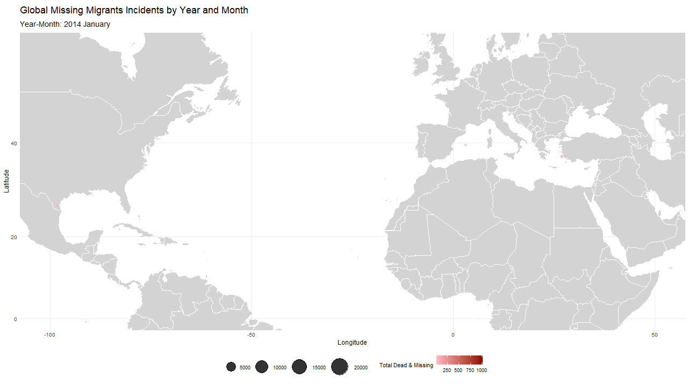

```{r, include=FALSE}
knitr::opts_chunk$set(echo = FALSE,
                      warning = FALSE,
                      tidy = FALSE,
                      message = FALSE,
                      fig.align = 'center',
                      out.width = "100%",
                      format = "html")
options(knitr.table.format = "html") 

# pagedown::chrome_print("myfile.Rmd") # to print the poster to pdf
# https://github.com/brentthorne/posterdown/wiki/posterdown_html # to see more options
```

```{r include=FALSE}
################################################################################
#                Statistics for Data Science Project - Group 37                #
#                                                                              #
# Authors:                                                                     #
# - André Filipe Gomes Silvestre (20240502)                                    #
# - Filipa Vieira Gonçalves Pereira (20240509)                                 #
# - Umeima Adam Mahomed (20240543)                                             #
################################################################################

# Data: Missing Migrants
# Source: https://missingmigrants.iom.int/downloads

# Load libraries
# install.packages("readxl")
# install.packages("tidyverse")
# install.packages("ggplot2")
# install.packages("dplyr")
# install.packages("ggmap")
# install.packages("maps")
# install.packages("mapdata")
# install.packages("visdat")
# install.packages("skimr")
# install.packages("gganimate")
# install.packages("gapminder")
# install.packages("mapproj")
# install.packages("lmtest")
# install.packages("plm")
# install.packages("caTools")


library(readxl)
library(tidyverse)
library(ggplot2)
library(dplyr)
library(ggmap)
library(maps)
library(mapdata)
library(visdat)
library(skimr)
library(gganimate)
library(gapminder)
library(mapproj)
library(lmtest)
library(plm)
library(caTools)

# Load data
missing_migrants <- read_excel("./Missing_Migrants_Global_Figures_allData.xlsx")

# Shape of the data
dim(missing_migrants)

# First 6 rows of the data
head(missing_migrants)

# ------------------------------------

# Check for duplicated rows
sum(duplicated(missing_migrants))

# List of Columns
colnames(missing_migrants)

# Structure of the data
str(missing_migrants)

# Summary of the data
summary(missing_migrants)

# Advanced summary of the data
skim(missing_migrants)

# ------------------------------------
#### Description of the variables ####
# Source: https://missingmigrants.iom.int/methodology

# Web ID (Main ID + Incident ID) -> An automatically generated number used to identify each unique entry in the dataset.
# [+] Incident Type -> The type of incident in which the migrant(s) died or went missing.
#                      Possible values include "Incident", "Split Incident", "Cumulative Incident"
# Region of Incident -> The region in which an incident took place. 
#                       For more about regional classifications used in the dataset, click here.
# Incident Date -> Estimated date of death. 
#                  If unknown, the date indicates when bodies were found or reported by witnesses/interviews.
# Incident Year -> The year in which the incident occurred.
# Incident Month -> The month in which the incident occurred.
# Number of Dead -> Total number of confirmed deaths (bodies recovered). 
#                   Left blank if only missing persons are reported.
# Number Missing -> Total number of missing persons assumed to be dead, often reported in cases of shipwrecks. 
#                   Left blank if none.
# Total Dead and Missing -> The sum of the ‘number dead’ and ‘number missing’ variables.
# Number of Survivors -> Total number of migrants that survived the incident, if known.
# Number of Females -> Number of females found dead or missing, based on third-party interpretations.
# Number of Males -> Number of males found dead or missing, based on third-party interpretations.
# Number of Children -> Number of individuals under the age of 18 found dead or missing.
# Country of Origin -> Country of birth of the decedent. Marked as “unknown” if not available.
# Region of Origin -> Region of origin of the decedent(s). 
#                     Marked as “Presumed” if deduced based on location or “unknown” if not available.
# Cause of Death -> Circumstances resulting in the migrant's death. 
#                   Includes additional notes if unknown (e.g., "Unknown – skeletal remains only").
# Location Description -> Description of the place where death(s) occurred or where the body or bodies were found. 
#                         Includes nearby landmarks when possible.
# Location Coordinates -> Geographic coordinates of the incident location. 
#                         Coordinates may be estimated, especially in regions like the Mediterranean.
# Survivors Route -> Name of the migrant route where the incident occurred, if known. 
#                    Left blank if unknown.
# UNSD Geographical Grouping -> Geographical region of the incident as per the United Nations Statistics Division (UNSD) geoscheme.
# Information source -> Name of the information source for the incident. 
#                       Multiple sources may be listed.
# Link -> Links to original reports of migrant deaths/disappearances, if available. 
#         Multiple links may be listed.
# Source quality -> Rank (1-5) indicating the reliability of the source(s) of information.
#                   Level 1: Single media source.
#                   Level 2: Uncorroborated eyewitness accounts or survey data.
#                   Level 3: Multiple media reports.
#                   Level 4: At least one NGO, IGO, or humanitarian actor with direct knowledge.
#                   Level 5: Official sources (e.g., coroners, government officials) or multiple humanitarian actors.

# ------------------------------------

# Value counts (n & %) for the "Incident Type" variable
missing_migrants %>%
  count(`Incident Type`, sort = TRUE) %>%
  mutate(percentage = round(n / sum(n) * 100, 1)) %>%
  as.data.frame()

# Filter the data with the "Incident Type" variable equal to "Incident"
missing_migrants_clean <- missing_migrants
missing_migrants_clean <- missing_migrants_clean %>%
  filter(`Incident Type` == "Incident")

# Value counts (n & %) for the "Source Quality" variable
missing_migrants_clean %>%
  count(`Source Quality`, sort = TRUE) %>%
  mutate(percentage = round(n / sum(n) * 100, 1)) %>%
  as.data.frame()

# Filter the data with the "Source Quality" variable greater or equal than 4
missing_migrants_clean <- missing_migrants_clean %>%
  filter(`Source Quality` >= 4)

# Drop columns that are not useful - "Main ID", "Incident ID"
missing_migrants_clean <- missing_migrants_clean %>% 
  select(-c("Main ID", "Incident ID"))

# Uniformize the NA values
missing_migrants_clean[missing_migrants_clean == ''] <- NA

# Define the size of the plot and Representation of the data type and NAs
# options(repr.plot.width = 10, repr.plot.height = 10)
# visdat::vis_dat(missing_migrants_clean, sort_type = FALSE)

# List the number of NAs and respective percentage for each variable
missing_migrants_clean %>%
  summarise_all(~sum(is.na(.))) %>%
  gather(variable, na_count) %>%
  mutate(na_percentage = round((na_count / nrow(missing_migrants_clean) * 100),1)) %>%
  arrange(desc(na_percentage)) %>%
  as.data.frame()

# ------------------------------------

# List of unique values for each variable
missing_migrants_clean %>%
  summarise_all(~length(unique(.))) %>%
  gather(variable, unique_count) %>%
  arrange(desc(unique_count)) %>%
  as.data.frame()

# List of unique values for categorical variables
missing_migrants_clean %>%
  select_if(is.character) %>%
  summarise(across(everything(), ~ list(unique(.)))) %>%
  pivot_longer(cols = everything(), names_to = "variable", values_to = "unique_values") %>%
  mutate(unique_count = sapply(unique_values, length)) %>%   # Count the number of unique values
  filter(unique_count < 100) %>%                             # Filter only the variables with less than 100 unique values
  select(-unique_count) %>%                                  # Drop the unique_count column
  as.data.frame()
```


# Introduction

Across the globe, the perilous journeys of migrants often lead to heartbreaking losses, a stark reminder of the human cost of migration. Each year, thousands of individuals vanish, leaving behind a legacy of unanswered questions and unacknowledged grief. This study seeks to explore the factors influencing these migrant deaths and disappearances, employing panel data analysis to understand how demographics and causes of death play a role in these tragedies. [@councilofeurope][@iomDecadeDocumenting] 

We begin by visualizing the distribution of migrant incidents over time using polar charts, followed by a spatial and temporal analysis through an animated global map. Subsequently, we delve into an econometric panel data analysis to further understand these grim statistics. [@R-posterdown]

## Research question

<center>**What are the factors that influence the total number of deaths and missing children in migrant incidents across regions and time?**</center>

# Methodology

We utilized data from the Missing Migrants Project provided by the IOM [@IOM_MissingMigrants]. The analysis begins by cleaning the data, filtering for incidents with a source quality of 4 or higher. 

To visualize temporal trends, we created polar charts displaying deaths (**Figure** \@ref(fig:polarcharts)), missing persons, survivors, and total incidents across different years. Next, we visualized the spatial and temporal distribution of migrant incidents through an animated global map (**Figure** \@ref(fig:mapanimation)). 

For econometric analysis, we performed panel data regressions, including `Pooled OLS`, `Fixed Effects`, and `Random Effects` models, to identify factors influencing the number of deaths and missing children during migration incidents.

```{r polarcharts, echo=FALSE, fig.cap='<span class="caption-text">Polar Charts of Migrant Incidents Over Years. Distribution of Deaths, Missing, Survivors, and Incidents by Year.</span>', fig.height=6}
# ------------------------------------
### Polar Charts ###

# Aggregate data for polar charts by year
polar_data <- missing_migrants_clean %>%
  group_by(`Incident Year`) %>%
  summarise(
    Deaths = sum(`Number of Dead`, na.rm = TRUE),
    Missing = sum((`Total Number of Dead and Missing` - `Number of Dead`), na.rm = TRUE),
    Survivors = sum(`Number of Survivors`, na.rm = TRUE),
    Incidents = n()
  ) %>%
  pivot_longer(
    cols = -`Incident Year`,
    names_to = "Category",
    values_to = "Count"
  )

# Create polar charts with facets for each category
polar_plot <- ggplot(polar_data, aes(x = as.factor(`Incident Year`), y = Count, fill = as.factor(`Incident Year`))) +
  geom_bar(stat = "identity", width = 1, color = "white", alpha = 0.8) +
  coord_polar(theta = "x") +
  
  # Custom color palette
  scale_fill_manual(
    values = colorRampPalette(c("darkred", "red", "lightcoral"))(length(unique(polar_data$`Incident Year`))),
    guide = "none" # Removes the legend
  ) +
  labs(
    title = "Polar Charts of Migrant Incidents Over Years",
    subtitle = "Distribution of Deaths, Missing, Survivors, and Incidents by Year\n",
    x = NULL, y = NULL
  ) +
  facet_wrap(~ Category, ncol = 2, scales = "free_y") +
  theme_minimal() +
  theme(
    strip.text = element_text(size = 12, face = "bold"),                     # Bold category titles
    plot.title = element_text(size = 16, face = "bold", hjust = 0.5),        # Center title
    plot.subtitle = element_text(size = 12, hjust = 0.5),                    # Center subtitle
    axis.text.x = element_text(size = 10, face = "bold"),                    # Bold axis text
    legend.position = "none"                                                 # Removes the legend entirely
  )

# Display the polar charts
polar_plot
```


The polar charts (**Figure** \@ref(fig:polarcharts)) reveal interesting temporal patterns. The number of deaths remains high between $2014$ and $2017$, decreasing in the following years. The number of missing persons also presents a similar pattern, but with a more volatile behavior. The survivor counts show a different behaviour, with an overall increase in later years. 

The total number of incidents appears to have its maximum around $2017$ and decreases in the following years. These visualizations suggest that while the number of reported deaths and missing persons has decreased, the survival rates have shown improvements over the last few years.

```{r, eval=FALSE, message=FALSE, warning=FALSE, include=FALSE}
### Data Visualization ###
# Source: https://www.kaggle.com/code/akyabahmed/maping-global-missing-migrants/notebook

# Prepare the data
map_data_clean <- missing_migrants_clean %>%
  filter(!is.na(`Coordinates`)) %>%
  mutate(
    lat = as.numeric(sub(",.*", "", `Coordinates`)), # Extract latitude
    lon = as.numeric(sub(".*,", "", `Coordinates`)), # Extract longitude
    year = `Incident Year`,
    YearMonth = paste(`Incident Year`, `Month`) # Create YearMonth variable
  )

# Order the YearMonth field
map_data_clean <- map_data_clean %>%
  mutate(
    # Create a DateOrder field to ensure proper ordering
    DateOrder = as.Date(paste(`Incident Year`, `Month`, "01", sep = " "), format = "%Y %B %d"),
    YearMonth = factor(YearMonth, levels = unique(YearMonth[order(DateOrder)])) # Order YearMonth by DateOrder
  )

# Check the ordered levels
levels(map_data_clean$YearMonth)

# Load world map data
world <- map_data("world")

# Create the animated map
map_animation <- ggplot() +
  geom_polygon(
    data = world,
    aes(x = long, y = lat, group = group),
    fill = "lightgray", color = "white", linewidth = 0.1
  ) +
  coord_map(xlim = c(-100, 50), ylim = c(0, 55)) +
  geom_point(
    data = map_data_clean,
    aes(
      x = lon, y = lat,
      color = `Total Number of Dead and Missing`,
      size = `Total Number of Dead and Missing` * 20
    ),
    alpha = 0.8
  ) +
  scale_color_gradient(low = "lightpink", high = "darkred", name = "Total Dead & Missing") +
  scale_size_continuous(range = c(1, 15), name = "") +
  labs(
    title = "Global Missing Migrants Incidents by Year and Month",
    subtitle = "Year-Month: {closest_state}",
    x = "Longitude", y = "Latitude"
  ) +
  theme_minimal() +
  theme(
    plot.title = element_text(face = "bold", size = 18),
    legend.position = "bottom",
    plot.subtitle = element_text(size = 14, face = "bold"),
    axis.text = element_text(size = 10),
    axis.title = element_text(size = 12)
  ) +
  transition_states(YearMonth, transition_length = 2, state_length = 1)


# Calculate the number of frames
n_years <- max(map_data_clean$year) - min(map_data_clean$year) + 1
n_frames <- n_years * 12

# Save the plot as a GIF
gganimate::anim_save("map_animation.gif",
                     animation = map_animation,
                     nframes = n_frames,
                     fps = 5,
                     width = 1280, height = 720,
                     dpi = 500,
                     renderer=gifski_renderer())
```


```{r mapanimation, echo=FALSE, fig.cap='<span class="caption-text">Animated Global Map of Missing Migrants Incidents by Year and Month.</span>', fig.height=7}

```


The animated map (**Figure** \@ref(fig:mapanimation)) effectively shows the geographical distribution of incidents over time. It highlights the **Mediterranean Sea** as a critical area for migrant deaths, with notable incidents occurring in **Central America** and along the borders between **Mexico and the United States**. 

The animated map shows that these incidents are relatively constant over time, emphasizing the continuous danger migrants face along these migration routes.

```{r message=FALSE, warning=FALSE, include=FALSE}
# ------------------------------------
### Data Cleaning ###

# Uniformize the values of the "Country of Origin" NA values ("Unknown")
missing_migrants_clean$`Country of Origin` <- ifelse(is.na(missing_migrants_clean$`Country of Origin`), "Unknown", missing_migrants_clean$`Country of Origin`)

# Value counts (n & %) for the "Cause of Death" variable
missing_migrants_clean %>%
  count(`Cause of Death`, sort = TRUE) %>%
  mutate(percentage = round(n / sum(n) * 100, 1)) %>%
  as.data.frame()


# Create a mapping of regions to continents
region_to_continent <- c(
  "Caribbean" = "Americas",
  "Central America" = "Americas",
  "Central Asia" = "Asia",
  "Eastern Africa" = "Africa",
  "Eastern Asia" = "Asia",
  "Europe" = "Europe",
  "Mediterranean" = "Europe",
  "Middle Africa" = "Africa",
  "North America" = "Americas",
  "Northern Africa" = "Africa",
  "South-eastern Asia" = "Asia",
  "South America" = "Americas",
  "Southern Africa" = "Africa",
  "Southern Asia" = "Asia",
  "Western Africa" = "Africa",
  "Western Asia" = "Asia"
)

# Add a new column for continents in the data
missing_migrants_clean$Continent <- region_to_continent[missing_migrants_clean$`Region of Incident`]

# Summarize the data by continents
continent_summary <- table(missing_migrants_clean$Continent)

# ------------------------------------

# Dummy variables for the "Cause of Death" variable
table(missing_migrants_clean$`Cause of Death`)
missing_migrants_clean <- missing_migrants_clean %>%
  mutate(
    Accidental_Death = ifelse(`Cause of Death` == "Accidental death", 1, 0),
    Drowning = ifelse(`Cause of Death` == "Drowning", 1, 0),
    Environmental_Conditions = ifelse(`Cause of Death` == "Harsh environmental conditions / lack of adequate shelter, food, water", 1, 0),
    Sickness = ifelse(`Cause of Death` == "Sickness / lack of access to adequate healthcare", 1, 0),
    Vehicle_Accident = ifelse(`Cause of Death` == "Vehicle accident / death linked to hazardous transport", 1, 0),
    Violence = ifelse(`Cause of Death` == "Violence", 1, 0)
  )

# n-1 Dummy variables for the "Cause of Death" variable (n = 7 & -1 = "Mixed or unknown")

# Rename variables with underscore, ex: 'Incident Year' -> 'Incident_Year'
names(missing_migrants_clean) <- gsub(" ", "_", names(missing_migrants_clean))

# Remove duplicated rows
missing_migrants_clean_gb <- missing_migrants_clean %>%
  group_by(Region_of_Incident, Incident_Date) %>%
  summarise(
    # Numeric variables - Sum
    Number_of_Children = sum(Number_of_Children, na.rm = TRUE),
    Number_of_Females = sum(Number_of_Females, na.rm = TRUE),
    Number_of_Males = sum(Number_of_Males, na.rm = TRUE),
    Number_of_Survivors = sum(Number_of_Survivors, na.rm = TRUE),
    Total_Number_of_Dead_and_Missing = sum(Total_Number_of_Dead_and_Missing, na.rm = TRUE),
    Number_of_Dead = sum(Number_of_Dead, na.rm = TRUE),
    Minimum_Estimated_Number_of_Missing = sum(Minimum_Estimated_Number_of_Missing, na.rm = TRUE),
    
    # Categorical variables - First value
    Country_of_Origin = first(Country_of_Origin),
    Region_of_Origin = first(Region_of_Origin),
    Cause_of_Death = first(Cause_of_Death),
    Migration_Route = first(Migration_Route),
    Coordinates = first(Coordinates),
    UNSD_Geographical_Grouping = first(UNSD_Geographical_Grouping),
    Information_Source = first(Information_Source),
    Continent = first(Continent),
    
    # Dummy variables
    Accidental_Death = first(Accidental_Death),
    Drowning = first(Drowning),
    Environmental_Conditions = first(Environmental_Conditions),
    Sickness = first(Sickness),
    Vehicle_Accident = first(Vehicle_Accident),
    Violence = first(Violence)
  ) %>%
  ungroup()

# Check if there are any duplicated rows
sum(duplicated(missing_migrants_clean_gb))

# Check for NAs
sum(is.na(missing_migrants_clean_gb))

# Remove NAs
missing_migrants_clean_gb <- na.omit(missing_migrants_clean_gb)


# ------------------------------------
# ### Panel Data ###

# Question 1: What are the factors that influence the total number of 
# deaths and missing children in migrant incidents across regions and time?

# Dependent Variable: log(Number of Children + 1)
# Independent Variables: log(Number of Females + 1), 
#                        log(Number of Males + 1), 
#                        log(Number of Survivors + 1), 
#                        `Cause of Death` [Dummys for each cause of death]

# Fixed Effects/Random Effects: ('Continent', 'Year')


# Pooled OLS
pooled_ols <- lm(log(Number_of_Children + 1) ~ log(Number_of_Females + 1) + 
                   log(Number_of_Males + 1) + log(Number_of_Survivors + 1) + Drowning,
                 data = missing_migrants_clean_gb)
summary(pooled_ols)

# Hetereoskedasticity Test - Breusch-Pagan Test
bp_test_pooled <- bptest(pooled_ols)

# Estimate the model by random effects
random_effects <- plm(log(Number_of_Children + 1) ~ log(Number_of_Females + 1) + 
                        log(Number_of_Males + 1) + log(Number_of_Survivors + 1) + Drowning,
                      data = missing_migrants_clean_gb, 
                      index = c("Region_of_Incident", "Incident_Date"),
                      model = "random")
summary(random_effects)

# Hetereoskedasticity Test - Breusch-Pagan Test [Random Effects]
bp_test_random <- bptest(random_effects)

# Estimate the model by fixed effects
fixed_effects <- plm(log(Number_of_Children + 1) ~ log(Number_of_Females + 1) + 
                       log(Number_of_Males + 1) + log(Number_of_Survivors + 1) + Drowning, 
                     data = missing_migrants_clean_gb,
                     index = c("Region_of_Incident", "Incident_Date"),
                     model = "within")
summary(fixed_effects)

# Hetereoskedasticity Test - Breusch-Pagan Test [Fixed Effects]
bp_test_fixed <- bptest(fixed_effects)

# Robust Hausman Test (Fixed Effects vs Random Effects)
hausman_test <- phtest(fixed_effects, random_effects, 
       vcov = function(x) vcovHC(x, method="white2", type="HC3"))

# Robust Pool OLS
pooled_ols_robust <- coeftest(pooled_ols, vcov = vcovHC(pooled_ols, type="HC0", cluster="group"))
pooled_ols_robust

# Robust Random Effects
random_effects_robust <- coeftest(random_effects, 
                                  vcov = vcovHC(random_effects, type="HC0", cluster="group"))
random_effects_robust

# Robust Fixed Effects
fixed_effects_robust <- coeftest(fixed_effects, vcov = vcovHC(fixed_effects, type="HC0", cluster="group"))
fixed_effects_robust
```

# Results

The panel data analysis investigates the factors influencing the number of deaths and missing children, controlling for region and time. **Table** \@ref(tab:stattests) presents the results of key statistical tests, and **Table** \@ref(tab:modelresults) displays the estimation results for `Pooled OLS`, `Random Effects`, and `Fixed Effects` models, alongside their robust counterparts.

```{r stattests}
# Statistics Test Table
test_results <- data.frame(
  Test = c("Robust Hausman", "Breusch Pagan (Pooled OLS, Homosk.)", "Breusch Pagan (FE, Homosk.)", "Breusch Pagan (RE, Homosk.)"),
  P_Value = c(hausman_test$p.value, bp_test_pooled$p.value, bp_test_fixed$p.value, bp_test_random$p.value),
  H0 = c("use random effects", "Homosk.", "Homosk.", "Homosk."),
  Conclusion = c(ifelse(hausman_test$p.value < 0.05, "use Fixed Effects", "use Random Effects"),
                ifelse(bp_test_pooled$p.value < 0.05, "Heterosk.", "Homosk."),
                ifelse(bp_test_fixed$p.value < 0.05, "Heterosk.", "Homosk."),
                ifelse(bp_test_random$p.value < 0.05, "Heterosk.", "Homosk."))
)
# Convert p-values to scientific notation
test_results$P_Value <- sprintf("%.2g", test_results$P_Value)

# Table with the results of the statistical tests
knitr::kable(test_results, 
             format = "html", 
             caption = "Results of Statistical Tests", 
             align = "c", col.names = c("Test", "p-value", "H0", "Conclusion"), 
             escape = TRUE)
```

The `Robust Hausman test`, with a p-value of $0.308$, suggests that the `Random Effects` model is more appropriate than the Fixed Effects model for our analysis. The Breusch-Pagan tests indicate the presence of heteroskedasticity in all models ($p-value<0.05$), making robust standard errors essential.

<br><br>


```{r modelresults}
# Função para adicionar os asteriscos de significância
add_significance_stars <- function(estimate, p_value) {
  stars <- case_when(
    p_value <= 0.001 ~ "***",
    p_value <= 0.01 ~ "**",
    p_value <= 0.05 ~ "*",
    TRUE ~ ""
  )
  paste(sprintf("%.3f", estimate), stars)
}


# Tabela com os valores estimados e as estrelas de significância
model_results <- data.frame(
  Model = c("Pooled OLS", "Fixed Effects", "Random Effects", "Robust Pooled", "Robust Fixed Effects", "Robust Random Effects"),
  Females = c(
    add_significance_stars(summary(pooled_ols)$coefficients["log(Number_of_Females + 1)", "Estimate"], summary(pooled_ols)$coefficients["log(Number_of_Females + 1)", "Pr(>|t|)"]),
    add_significance_stars(summary(fixed_effects)$coefficients["log(Number_of_Females + 1)", "Estimate"], summary(fixed_effects)$coefficients["log(Number_of_Females + 1)", "Pr(>|t|)"]),
    add_significance_stars(summary(random_effects)$coefficients["log(Number_of_Females + 1)", "Estimate"], summary(random_effects)$coefficients["log(Number_of_Females + 1)", "Pr(>|z|)"]),
    add_significance_stars(pooled_ols_robust["log(Number_of_Females + 1)", "Estimate"], pooled_ols_robust["log(Number_of_Females + 1)", "Pr(>|t|)"]),
    add_significance_stars(fixed_effects_robust["log(Number_of_Females + 1)", "Estimate"], fixed_effects_robust["log(Number_of_Females + 1)", "Pr(>|t|)"]),
    add_significance_stars(random_effects_robust["log(Number_of_Females + 1)", "Estimate"], random_effects_robust["log(Number_of_Females + 1)", "Pr(>|t|)"])
    ),
    Males = c(
    add_significance_stars(summary(pooled_ols)$coefficients["log(Number_of_Males + 1)", "Estimate"], summary(pooled_ols)$coefficients["log(Number_of_Males + 1)", "Pr(>|t|)"]),
    add_significance_stars(summary(fixed_effects)$coefficients["log(Number_of_Males + 1)", "Estimate"], summary(fixed_effects)$coefficients["log(Number_of_Males + 1)", "Pr(>|t|)"]),
    add_significance_stars(summary(random_effects)$coefficients["log(Number_of_Males + 1)", "Estimate"], summary(random_effects)$coefficients["log(Number_of_Males + 1)", "Pr(>|z|)"]),
    add_significance_stars(pooled_ols_robust["log(Number_of_Males + 1)", "Estimate"], pooled_ols_robust["log(Number_of_Males + 1)", "Pr(>|t|)"]),
    add_significance_stars(fixed_effects_robust["log(Number_of_Males + 1)", "Estimate"], fixed_effects_robust["log(Number_of_Males + 1)", "Pr(>|t|)"]),
    add_significance_stars(random_effects_robust["log(Number_of_Males + 1)", "Estimate"], random_effects_robust["log(Number_of_Males + 1)", "Pr(>|t|)"])
    ),
    Survivors = c(
    add_significance_stars(summary(pooled_ols)$coefficients["log(Number_of_Survivors + 1)", "Estimate"], summary(pooled_ols)$coefficients["log(Number_of_Survivors + 1)", "Pr(>|t|)"]),
    add_significance_stars(summary(fixed_effects)$coefficients["log(Number_of_Survivors + 1)", "Estimate"], summary(fixed_effects)$coefficients["log(Number_of_Survivors + 1)", "Pr(>|t|)"]),
    add_significance_stars(summary(random_effects)$coefficients["log(Number_of_Survivors + 1)", "Estimate"], summary(random_effects)$coefficients["log(Number_of_Survivors + 1)", "Pr(>|z|)"]),
    add_significance_stars(pooled_ols_robust["log(Number_of_Survivors + 1)", "Estimate"], pooled_ols_robust["log(Number_of_Survivors + 1)", "Pr(>|t|)"]),
    add_significance_stars(fixed_effects_robust["log(Number_of_Survivors + 1)", "Estimate"], fixed_effects_robust["log(Number_of_Survivors + 1)", "Pr(>|t|)"]),
    add_significance_stars(random_effects_robust["log(Number_of_Survivors + 1)", "Estimate"], random_effects_robust["log(Number_of_Survivors + 1)", "Pr(>|t|)"])
    ),
    Drowning = c(
    add_significance_stars(summary(pooled_ols)$coefficients["Drowning", "Estimate"], summary(pooled_ols)$coefficients["Drowning", "Pr(>|t|)"]),
    add_significance_stars(summary(fixed_effects)$coefficients["Drowning", "Estimate"], summary(fixed_effects)$coefficients["Drowning", "Pr(>|t|)"]),
    add_significance_stars(summary(random_effects)$coefficients["Drowning", "Estimate"], summary(random_effects)$coefficients["Drowning", "Pr(>|z|)"]),
    add_significance_stars(pooled_ols_robust["Drowning", "Estimate"], pooled_ols_robust["Drowning", "Pr(>|t|)"]),
    add_significance_stars(fixed_effects_robust["Drowning", "Estimate"], fixed_effects_robust["Drowning", "Pr(>|t|)"]),
    add_significance_stars(random_effects_robust["Drowning", "Estimate"], random_effects_robust["Drowning", "Pr(>|t|)"])
  )
)

# Criando a tabela com os resultados dos modelos
knitr::kable(model_results, 
             format = "html", 
             caption = "Results of Statistical Models", 
             align = "c", col.names = c("Model", "Females", "Males", "Survivors", "Drowning"),
             escape = TRUE)
```


**Table** \@ref(tab:modelresults) shows that the number of females and males involved in a migration incident are significant predictors of the number of children deaths and missing persons. The coefficient of $\text{log(Number_of_Females + 1)}$ shows a positive impact across all models. The $\text{log(Number_of_Males + 1)}$ also presents a positive influence, with similar values, across all models. 

Moreover, a higher number of survivors is negatively related with child deaths and missing, which is expected. 

Finally, the positive coefficient of `Drowning` indicates that incidents caused by drowning are positively associated with child deaths and missing, which is expected since drowning incidents usually involve larger groups of people.

# Next Steps

Further research could explore additional factors such as the role of smuggling networks and the degree of conflict in the countries of origin. Expanding the dataset with additional socioeconomic and political variables could provide further insights. 

It would be interesting to control for the political regime and levels of corruption in the countries. Analyzing the different migration routes could also reveal important patterns not captured in this analysis.

# Conclusion

Our analysis provides a comprehensive examination of factors influencing migrant deaths and disappearances. The visualization of temporal and geographical data reveals critical regions and time periods of high risk, while the econometric analysis highlights significant relationships between demographics, causes of death, and the number of child deaths and missing persons during migration incidents. 

Specifically, the significant impact of the number of female and male migrants, the negative impact of the number of survivors and the positive impact of drowning in incidents of death and missing children call for further investigation and targeted strategies. 

# References
