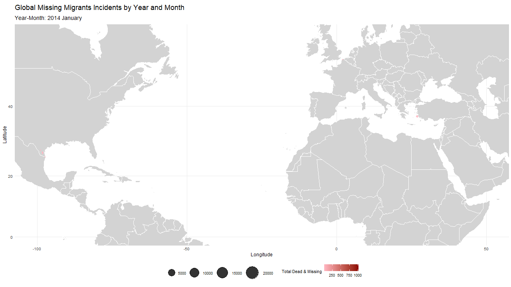

```{r, include=FALSE}
# Template: https://github.com/brentthorne/posterdown/wiki/posterdown_html
knitr::opts_chunk$set(echo = FALSE,
                      warning = FALSE,
                      tidy = FALSE,
                      message = FALSE,
                      fig.align = 'center',
                      out.width = "100%",
                      format = "html")
options(knitr.table.format = "html") 
```

```{r include=FALSE}
################################################################################
#                Statistics for Data Science Project - Group 37                #
#                                                                              #
# Authors:                                                                     #
# - André Filipe Gomes Silvestre (20240502)                                    #
# - Filipa Vieira Gonçalves Pereira (20240509)                                 #
# - Umeima Adam Mahomed (20240543)                                             #
################################################################################

# Data: Missing Migrants
# Source: https://missingmigrants.iom.int/downloads

# Load libraries
# install.packages("readxl")
# install.packages("tidyverse")
# install.packages("ggplot2")
# install.packages("dplyr")
# install.packages("ggmap")
# install.packages("maps")
# install.packages("mapdata")
# install.packages("visdat")
# install.packages("skimr")
# install.packages("moments")
# install.packages("gganimate")
# install.packages("gapminder")
# install.packages("mapproj")
# install.packages("lmtest")
# install.packages("plm")
# install.packages("caTools")


library(readxl)
library(tidyverse)
library(ggplot2)
library(dplyr)
library(ggmap)
library(maps)
library(mapdata)
library(visdat)
library(skimr)
library(moments)
library(gganimate)
library(gapminder)
library(mapproj)
library(lmtest)
library(plm)
library(caTools)

# Load data
missing_migrants <- read_excel("./Missing_Migrants_Global_Figures_allData.xlsx")

# Shape of the data
dim(missing_migrants)

# First 6 rows of the data
head(missing_migrants)

# ------------------------------------

# Check for duplicated rows
sum(duplicated(missing_migrants))

# List of Columns
colnames(missing_migrants)

# Structure of the data
str(missing_migrants)

# Summary of the data
summary(missing_migrants)

# Advanced summary of the data (+ Skewness and Kurtosis)
skim(missing_migrants) 

# ------------------------------------
#### Description of the variables ####
# Source: https://missingmigrants.iom.int/methodology

# Web ID (Main ID + Incident ID) -> An automatically generated number used to identify each unique entry in the dataset.
# [+] Incident Type -> The type of incident in which the migrant(s) died or went missing.
#                      Possible values include "Incident", "Split Incident", "Cumulative Incident"
# Region of Incident -> The region in which an incident took place. 
#                       For more about regional classifications used in the dataset, click here.
# Incident Date -> Estimated date of death. 
#                  If unknown, the date indicates when bodies were found or reported by witnesses/interviews.
# Incident Year -> The year in which the incident occurred.
# Incident Month -> The month in which the incident occurred.
# Number of Dead -> Total number of confirmed deaths (bodies recovered). 
#                   Left blank if only missing persons are reported.
# Number Missing -> Total number of missing persons assumed to be dead, often reported in cases of shipwrecks. 
#                   Left blank if none.
# Total Dead and Missing -> The sum of the ‘number dead’ and ‘number missing’ variables.
# Number of Survivors -> Total number of migrants that survived the incident, if known.
# Number of Females -> Number of females found dead or missing, based on third-party interpretations.
# Number of Males -> Number of males found dead or missing, based on third-party interpretations.
# Number of Children -> Number of individuals under the age of 18 found dead or missing.
# Country of Origin -> Country of birth of the decedent. Marked as “unknown” if not available.
# Region of Origin -> Region of origin of the decedent(s). 
#                     Marked as “Presumed” if deduced based on location or “unknown” if not available.
# Cause of Death -> Circumstances resulting in the migrant's death. 
#                   Includes additional notes if unknown (e.g., "Unknown – skeletal remains only").
# Location Description -> Description of the place where death(s) occurred or where the body or bodies were found. 
#                         Includes nearby landmarks when possible.
# Location Coordinates -> Geographic coordinates of the incident location. 
#                         Coordinates may be estimated, especially in regions like the Mediterranean.
# Survivors Route -> Name of the migrant route where the incident occurred, if known. 
#                    Left blank if unknown.
# UNSD Geographical Grouping -> Geographical region of the incident as per the United Nations Statistics Division (UNSD) geoscheme.
# Information source -> Name of the information source for the incident. 
#                       Multiple sources may be listed.
# Link -> Links to original reports of migrant deaths/disappearances, if available. 
#         Multiple links may be listed.
# Source quality -> Rank (1-5) indicating the reliability of the source(s) of information.
#                   Level 1: Single media source.
#                   Level 2: Uncorroborated eyewitness accounts or survey data.
#                   Level 3: Multiple media reports.
#                   Level 4: At least one NGO, IGO, or humanitarian actor with direct knowledge.
#                   Level 5: Official sources (e.g., coroners, government officials) or multiple humanitarian actors.

# ------------------------------------

# Value counts (n & %) for the "Incident Type" variable
missing_migrants %>%
  count(`Incident Type`, sort = TRUE) %>%
  mutate(percentage = round(n / sum(n) * 100, 1)) %>%
  as.data.frame()

# Filter the data with the "Incident Type" variable equal to "Incident"
missing_migrants_clean <- missing_migrants
missing_migrants_clean <- missing_migrants_clean %>%
  filter(`Incident Type` == "Incident")

# Value counts (n & %) for the "Source Quality" variable
missing_migrants_clean %>%
  count(`Source Quality`, sort = TRUE) %>%
  mutate(percentage = round(n / sum(n) * 100, 1)) %>%
  as.data.frame()

# Filter the data with the "Source Quality" variable greater or equal than 4
missing_migrants_clean <- missing_migrants_clean %>%
  filter(`Source Quality` >= 4)

# Drop columns that are not useful - "Main ID", "Incident ID"
missing_migrants_clean <- missing_migrants_clean %>% 
  select(-c("Main ID", "Incident ID"))

# Uniformize the NA values
missing_migrants_clean[missing_migrants_clean == ''] <- NA

# Define the size of the plot and Representation of the data type and NAs
# options(repr.plot.width = 10, repr.plot.height = 10)
# visdat::vis_dat(missing_migrants_clean, sort_type = FALSE)

# List the number of NAs and respective percentage for each variable
missing_migrants_clean %>%
  summarise_all(~sum(is.na(.))) %>%
  gather(variable, na_count) %>%
  mutate(na_percentage = round((na_count / nrow(missing_migrants_clean) * 100),1)) %>%
  arrange(desc(na_percentage)) %>%
  as.data.frame()

# ------------------------------------

# List of unique values for each variable
missing_migrants_clean %>%
  summarise_all(~length(unique(.))) %>%
  gather(variable, unique_count) %>%
  arrange(desc(unique_count)) %>%
  as.data.frame()

# List of unique values for categorical variables
missing_migrants_clean %>%
  select_if(is.character) %>%
  summarise(across(everything(), ~ list(unique(.)))) %>%
  pivot_longer(cols = everything(), names_to = "variable", values_to = "unique_values") %>%
  mutate(unique_count = sapply(unique_values, length)) %>%   # Count the number of unique values
  filter(unique_count < 100) %>%                             # Filter only the variables with less than 100 unique values
  select(-unique_count) %>%                                  # Drop the unique_count column
  as.data.frame()
```

# Introduction

The deaths and disappearances of migrants while on the move are a key concern across the world. There is a serious need to investigate the factors behind it properly. Since 2014, statistics indicate that at least 4,000 people have perished every year on migration routes, and 2022 was the worst year, with more than 8,500 deaths. [@councilofeurope][@MigrantionDataPortal] In particular, children need special attention, as this demographic is particularly vulnerable due to their age. [@MigrantionDataPortal_Children]

The present study begins by illustrating the temporal and spatial distribution of these events using polar diagrams and an animated globe. Following this, an econometric panel data analysis will be employed to provide more detailed insights, to inform policy interventions to prevent future occurrences. [@R-posterdown]

## Research question

<center>**What are the factors that influence the total number of deaths and missing children in migrant incidents across continents and time?**</center>

# Methodology

The current research reports data collected from the **Missing Migrants Project** [@IOM_MissingMigrants]for the period from $2014$ to $2024$, which resulted in $5,462$ entries after some preprocessing. Preprocessing involved the elimination of duplicates, filtering for high-quality source information, and the selection of relevant variables, identified through literature, theoretical considerations and variables available in the dataset. Furthermore, enrich the analysis with contextual factors such as country GDP and political regime. However, data on migrant populations within specific borders at given times, crucial for a robust analysis, proved challenging to obtain consistently across all regions and periods. 

We transformed our variables by using dummy variables for the `Cause of Death` and logarithmic transformations for non-normal distributions considering skewness and kurtosis analyses. Linear relationships were incorporated into the model due to theoretical reasoning and literature on the topic. For our analysis, we employed panel data regressions, analyzing `Pooled OLS`, `Fixed Effects`, and `Random Effects` models. Econometric tests (including `Breusch-Pagan` and `Hausman tests`) were conducted to determine which model was most appropriate for the data. This approach allows us to isolate key factors and provide insights to inform interventions aimed at preventing future incidents.


# Initial Analysis

The polar charts (**Figure** \@ref(fig:polarcharts)) reveal notable temporal patterns. The number of deaths shows a general increase over the years, but a decrease in $2018$ and $2019$. The number of missing persons presents some oscillations, with peaks around $2016$ and $2023$. The number of documented incidents shows a steady increase until $2023$. Finally, the survivor counts show an overall increasing trend with a peak around $2016$.

```{r polarcharts, echo=FALSE, fig.cap='<span class="caption-text">Polar Charts of Migrant Incidents Over Years. Distribution of Deaths, Missing, Survivors, and Incidents by Year.</span>', fig.height=6}
# ------------------------------------
### Polar Charts ###

# Aggregate data for polar charts by year
polar_data <- missing_migrants_clean %>%
  group_by(`Incident Year`) %>%
  summarise(
    Deaths = sum(`Number of Dead`, na.rm = TRUE),
    Missing = sum((`Total Number of Dead and Missing` - `Number of Dead`), na.rm = TRUE),
    Survivors = sum(`Number of Survivors`, na.rm = TRUE),
    Incidents = n()
  ) %>%
  pivot_longer(
    cols = -`Incident Year`,
    names_to = "Category",
    values_to = "Count"
  )

# Create polar charts with facets for each category
polar_plot <- ggplot(polar_data, aes(x = as.factor(`Incident Year`), y = Count, fill = as.factor(`Incident Year`))) +
  geom_bar(stat = "identity", width = 1, color = "white", alpha = 0.8) +
  coord_polar(theta = "x") +
  
  # Custom color palette
  scale_fill_manual(
    values = colorRampPalette(c("darkred", "red", "lightcoral"))(length(unique(polar_data$`Incident Year`))),
    guide = "none" # Removes the legend
  ) +
  labs(
    title = "Polar Charts of Migrant Incidents Over Years",
    subtitle = "Distribution of Deaths, Missing, Survivors, and Incidents by Year\n",
    x = NULL, y = NULL
  ) +
  facet_wrap(~ Category, ncol = 2, scales = "free_y") +
  theme_minimal() +
  theme(
    strip.text = element_text(size = 12, face = "bold"),                     # Bold category titles
    plot.title = element_text(size = 16, face = "bold", hjust = 0.5),        # Center title
    plot.subtitle = element_text(size = 12, hjust = 0.5),                    # Center subtitle
    axis.text.x = element_text(size = 8, face = "bold"),                     # Bold axis text
    legend.position = "none",                                                # Removes the legend entirely
    panel.spacing = unit(0.3, "lines"),                                      # Increases the space between facets
    plot.margin = margin(.5, .5, .2, .2, "cm")
  )

# Display the polar charts
polar_plot
```

```{r, eval=FALSE, message=FALSE, warning=FALSE, include=FALSE}
### Data Visualization ###

# Prepare the data
map_data_clean <- missing_migrants_clean %>%
  filter(!is.na(`Coordinates`)) %>%
  mutate(
    lat = as.numeric(sub(",.*", "", `Coordinates`)), # Extract latitude
    lon = as.numeric(sub(".*,", "", `Coordinates`)), # Extract longitude
    year = `Incident Year`,
    YearMonth = paste(`Incident Year`, `Month`) # Create YearMonth variable
  )

# Order the YearMonth field
map_data_clean <- map_data_clean %>%
  mutate(
    # Create a DateOrder field to ensure proper ordering
    DateOrder = as.Date(paste(`Incident Year`, `Month`, "01", sep = " "), format = "%Y %B %d"),
    YearMonth = factor(YearMonth, levels = unique(YearMonth[order(DateOrder)])) # Order YearMonth by DateOrder
  )

# Check the ordered levels
levels(map_data_clean$YearMonth)

# Load world map data
world <- map_data("world")

# Create the animated map
map_animation <- ggplot() +
  geom_polygon(
    data = world,
    aes(x = long, y = lat, group = group),
    fill = "lightgray", color = "white", linewidth = 0.1
  ) +
  coord_map(xlim = c(-100, 50), ylim = c(0, 55)) +
  geom_point(
    data = map_data_clean,
    aes(
      x = lon, y = lat,
      color = `Total Number of Dead and Missing`,
      size = `Total Number of Dead and Missing` * 20
    ),
    alpha = 0.8
  ) +
  scale_color_gradient(low = "lightpink", high = "darkred", name = "Total Dead & Missing") +
  scale_size_continuous(range = c(1, 15), name = "") +
  labs(
    title = "Global Missing Migrants Incidents by Year and Month",
    subtitle = "Year-Month: {closest_state}",
    x = "Longitude", y = "Latitude"
  ) +
  theme_minimal() +
  theme(
    plot.title = element_text(face = "bold", size = 18),
    legend.position = "bottom",
    plot.subtitle = element_text(size = 14, face = "bold"),
    axis.text = element_text(size = 10),
    axis.title = element_text(size = 12)
  ) +
  transition_states(YearMonth, transition_length = 2, state_length = 1)


# Calculate the number of frames
n_years <- max(map_data_clean$year) - min(map_data_clean$year) + 1
n_frames <- n_years * 12

# Save the plot as a GIF
gganimate::anim_save("map_animation.gif",
                     animation = map_animation,
                     nframes = n_frames,
                     fps = 5,
                     width = 1280, height = 720,
                     dpi = 500,
                     renderer=gifski_renderer())
```

The animated map (**Figure** \@ref(fig:mapanimation)) effectively shows the geographical distribution of incidents over time. It highlights the **Mediterranean Sea** as a critical area for migrant deaths, with notable incidents occurring in **Central America** and along the borders between **Mexico and USA**.

```{r mapanimation, echo=FALSE, fig.cap='<span class="caption-text">Animated Global Map of Missing Migrants Incidents by Year and Month.</span>', fig.height=7}

```
```{r message=FALSE, warning=FALSE, include=FALSE}
# ------------------------------------
### Data Cleaning ###

# Uniformize the values of the "Country of Origin" NA values ("Unknown")
missing_migrants_clean$`Country of Origin` <- ifelse(is.na(missing_migrants_clean$`Country of Origin`), "Unknown", missing_migrants_clean$`Country of Origin`)

# Value counts (n & %) for the "Cause of Death" variable
missing_migrants_clean %>%
  count(`Cause of Death`, sort = TRUE) %>%
  mutate(percentage = round(n / sum(n) * 100, 1)) %>%
  as.data.frame()

# Create a mapping of regions to continents
region_to_continent <- c(
  "Caribbean" = "Americas",
  "Central America" = "Americas",
  "Central Asia" = "Asia",
  "Eastern Africa" = "Africa",
  "Eastern Asia" = "Asia",
  "Europe" = "Europe",
  "Mediterranean" = "Europe",
  "Middle Africa" = "Africa",
  "North America" = "Americas",
  "Northern Africa" = "Africa",
  "South-eastern Asia" = "Asia",
  "South America" = "Americas",
  "Southern Africa" = "Africa",
  "Southern Asia" = "Asia",
  "Western Africa" = "Africa",
  "Western Asia" = "Asia"
)

# Add a new column for continents in the data
missing_migrants_clean$Continent <- region_to_continent[missing_migrants_clean$`Region of Incident`]

# Summarize the data by continents
continent_summary <- table(missing_migrants_clean$Continent)

# ------------------------------------

# Dummy variables for the "Cause of Death" variable
table(missing_migrants_clean$`Cause of Death`)
missing_migrants_clean <- missing_migrants_clean %>%
  mutate(
    Accidental_Death = ifelse(`Cause of Death` == "Accidental death", 1, 0),
    Drowning = ifelse(`Cause of Death` == "Drowning", 1, 0),
    Environmental_Conditions = ifelse(`Cause of Death` == "Harsh environmental conditions / lack of adequate shelter, food, water", 1, 0),
    Sickness = ifelse(`Cause of Death` == "Sickness / lack of access to adequate healthcare", 1, 0),
    Vehicle_Accident = ifelse(`Cause of Death` == "Vehicle accident / death linked to hazardous transport", 1, 0),
    Violence = ifelse(`Cause of Death` == "Violence", 1, 0)
  )

# n-1 Dummy variables for the "Cause of Death" variable (n = 7 & -1 = "Mixed or unknown")

# Rename variables with underscore, ex: 'Incident Year' -> 'Incident_Year'
names(missing_migrants_clean) <- gsub(" ", "_", names(missing_migrants_clean))

# Remove duplicated rows
missing_migrants_clean_gb_w_NAs <- missing_migrants_clean %>%
  group_by(Region_of_Incident, Incident_Date) %>%
  summarise(
    # Numeric variables - Sum
    Number_of_Children = sum(Number_of_Children, na.rm = TRUE),
    Number_of_Females = sum(Number_of_Females, na.rm = TRUE),
    Number_of_Males = sum(Number_of_Males, na.rm = TRUE),
    Number_of_Survivors = sum(Number_of_Survivors, na.rm = TRUE),
    Total_Number_of_Dead_and_Missing = sum(Total_Number_of_Dead_and_Missing, na.rm = TRUE),
    Number_of_Dead = sum(Number_of_Dead, na.rm = TRUE),
    Minimum_Estimated_Number_of_Missing = sum(Minimum_Estimated_Number_of_Missing, na.rm = TRUE),
    
    # Categorical variables - First value
    Country_of_Origin = first(Country_of_Origin),
    Region_of_Origin = first(Region_of_Origin),
    Cause_of_Death = first(Cause_of_Death),
    Migration_Route = first(Migration_Route),
    Coordinates = first(Coordinates),
    UNSD_Geographical_Grouping = first(UNSD_Geographical_Grouping),
    Information_Source = first(Information_Source),
    Continent = first(Continent),
    
    # Dummy variables
    Accidental_Death = first(Accidental_Death),
    Drowning = first(Drowning),
    Environmental_Conditions = first(Environmental_Conditions),
    Sickness = first(Sickness),
    Vehicle_Accident = first(Vehicle_Accident),
    Violence = first(Violence)
  ) %>%
  ungroup()

# Check if there are any duplicated rows
sum(duplicated(missing_migrants_clean_gb_w_NAs))

# Check for NAs
sum(is.na(missing_migrants_clean_gb_w_NAs))

# Remove NAs
missing_migrants_clean_gb <- na.omit(missing_migrants_clean_gb_w_NAs)

# -----------------

# Calcular Skewness e Kurtosis
numeric_vars <- sapply(missing_migrants_clean_gb, is.numeric)
skewness_values <- sapply(missing_migrants_clean_gb[, numeric_vars], skewness, na.rm = TRUE)
kurtosis_values <- sapply(missing_migrants_clean_gb[, numeric_vars], kurtosis, na.rm = TRUE)

#
skim_summary <- skim(missing_migrants_clean_gb)
skim_numeric <- skim_summary %>%
  dplyr::filter(skim_type == "numeric")
skim_numeric <- skim_numeric %>%
  dplyr::mutate(
    skewness = skewness_values[skim_variable],
    kurtosis = kurtosis_values[skim_variable]
  )

skim_numeric

knitr::kable(skim_numeric, 
             format = "html", 
             caption = "Advanced Summary with Skewness and Kurtosis")

# ------------------------------------
# ### Panel Data ###

# Question: What are the factors that influence the total number of 
#           deaths and missing children in migrant incidents across regions and time?

# Dependent Variable: log(Number of Children + 1)
# Independent Variables: log(Number of Females + 1), 
#                        log(Number of Males + 1), 
#                        log(Number of Survivors + 1), 
#                        `Cause of Death` [Dummys for each cause of death]

# Fixed Effects/Random Effects: ('Continent', 'Year')

# Pooled OLS
pooled_ols <- plm(log(Number_of_Children + 1) ~ log(Number_of_Females + 1) + 
                   log(Number_of_Males + 1) + log(Number_of_Survivors + 1) + Drowning,
                 data = missing_migrants_clean_gb,
                 index=c("Region_of_Incident", "Incident_Date"),
                 model='pooling')
summary(pooled_ols)

# Lagrange Multiplier Test for Random Effects
pooled_ols_lmtest <- plmtest(pooled_ols, type = "bp") # "bp" for Breusch-Pagan version

# Hetereoskedasticity Test - Breusch-Pagan Test
bp_test_pooled <- bptest(pooled_ols)

# Estimate the model by random effects
random_effects <- plm(log(Number_of_Children + 1) ~ log(Number_of_Females + 1) + 
                        log(Number_of_Males + 1) + log(Number_of_Survivors + 1) + Drowning,
                      data = missing_migrants_clean_gb, 
                      index = c("Region_of_Incident", "Incident_Date"),
                      model = "random")
summary(random_effects)

# Hetereoskedasticity Test - Breusch-Pagan Test [Random Effects]
bp_test_random <- bptest(random_effects)

# Estimate the model by fixed effects
fixed_effects <- plm(log(Number_of_Children + 1) ~ log(Number_of_Females + 1) + 
                       log(Number_of_Males + 1) + log(Number_of_Survivors + 1) + Drowning, 
                     data = missing_migrants_clean_gb,
                     index = c("Region_of_Incident", "Incident_Date"),
                     model = "within")
summary(fixed_effects)

# Hetereoskedasticity Test - Breusch-Pagan Test [Fixed Effects]
bp_test_fixed <- bptest(fixed_effects)

# Robust Hausman Test (Fixed Effects vs Random Effects)
hausman_test <- phtest(fixed_effects, random_effects, 
                       vcov = function(x) vcovHC(x, method="white2", type="HC3"))

# Robust Pool OLS
pooled_ols_robust <- coeftest(pooled_ols, 
                              vcov = vcovHC(pooled_ols, type="HC0", cluster="group"))
pooled_ols_robust

# Robust Random Effects
random_effects_robust <- coeftest(random_effects,
                                  vcov = vcovHC(random_effects, type="HC0", cluster="group"))
random_effects_robust

# Robust Fixed Effects
fixed_effects_robust <- coeftest(fixed_effects, 
                                 vcov = vcovHC(fixed_effects, type="HC0", cluster="group"))
fixed_effects_robust
```

# Results

The panel data analysis investigates the factors influencing the number of deaths and missing children, controlling for **continent** and **time**. **Table** \@ref(tab:stattests) presents the results of key statistical tests, and **Table** \@ref(tab:modelresults) displays the estimation results for Robust Random Effects.

```{r stattests}
# Statistics Test Table
test_results <- data.frame(
  Test = c("Breusch Pagan (POLS)", "Breusch Pagan (FE)", "Breusch Pagan (RE)", "Robust Hausman", "Lagrange Multiplier (Breusch Pagan)"),
  P_Value = c(ifelse(bp_test_pooled$p.value < 0.05, "< 2.2e-16", round(bp_test_pooled$p.value, 3)),
              ifelse(bp_test_fixed$p.value < 0.05, "< 2.2e-16", round(bp_test_fixed$p.value, 3)),
              ifelse(bp_test_random$p.value < 0.05, "< 2.2e-16", round(bp_test_random$p.value, 3)),
              ifelse(hausman_test$p.value < 0.05, "< 2.2e-16", round(hausman_test$p.value, 3)),
              ifelse(pooled_ols_lmtest$p.value < 0.05, "< 2.2e-16", round(pooled_ols_lmtest$p.value, 3))),
  H0 = c("Homosk.", "Homosk.", "Homosk.", "Random Effects", "No Panel Effects"),
  Conclusion = c(ifelse(bp_test_pooled$p.value < 0.05, "Heterosk.", "Homosk."),
                ifelse(bp_test_fixed$p.value < 0.05, "Heterosk.", "Homosk."),
                ifelse(bp_test_random$p.value < 0.05, "Heterosk.", "Homosk."),
                ifelse(hausman_test$p.value < 0.05, "Fixed Effects", "Random Effects"),
                ifelse(pooled_ols_lmtest$p.value < 0.05, "Panel Effects", "No Panel Effects")))

# Table with the results of the statistical tests
knitr::kable(test_results, 
             format = "html", 
             caption = "Results of Statistical Tests", 
             align = "c", col.names = c("Test", "p-value", "H0", "Conclusion"), 
             escape = TRUE)
```

The **`Breusch-Pagan` tests**, regardless of the type of model used, suggest the presence of **heteroskedasticity** ($p$-value < $\alpha = 5\%$). This gives statistical evidence that the errors are not homoscedastic, hence the need for the use of **robust standard errors**. 

**`Lagrange Multiplier` test** [@breusch1980lagrange] ($p$-value < $\alpha = 5\%$) supports that the **Random Effects** model is more appropriate than the **Pooled OLS** model. 

For the **`Robust Hausman` test** performed, we obtained the p-value of $0.929$. This result suggests that the **`Fixed` and `Random Effects` Models** are consistent, but the only the latter is efficient.

<br>

```{r modelresults}
# Function to add significance stars
add_significance_stars <- function(p_value) {
  stars <- case_when(
    p_value <= 0.001 ~ "***",
    p_value <= 0.01 ~ "**",
    p_value <= 0.05 ~ "*",
    TRUE ~ ""
  )
  paste(sprintf("%.3f", p_value), stars)
}

# Convert the results to a data frame
random_effects_robust_df <- data.frame(
  Estimate = round(random_effects_robust[, 1],3),
  Std_Error = round(random_effects_robust[, 2],3),
  t_value = round(random_effects_robust[, 3],3),
  p_value = c(add_significance_stars(random_effects_robust[1, 4]),
              add_significance_stars(random_effects_robust[2, 4]),
              add_significance_stars(random_effects_robust[3, 4]),
              add_significance_stars(random_effects_robust[4, 4]),
              add_significance_stars(random_effects_robust[5, 4]))
)

# Rename the index of the data frame
rownames(random_effects_robust_df) <- c("(Intercept)", "log(Number of Females)", "log(Number of Males)", "log(Number of Survivors)", "Drowning")

# Table with the results of the statistical models
knitr::kable(random_effects_robust_df, 
             format = "html", 
             caption = "Random Effects Model With Robust Standard Errors",
             align = "c", 
             col.names = c("Estimate", "Std. Error", "t-value", "Pr(>|t|)"),
             escape = TRUE)
```


**Table** \@ref(tab:modelresults) presents the results from our **`Robust Random Effects`** model, which examines factors influencing child deaths or missing (D&M) in migrant incidents. Both `log(Number of Females)` and `log(Number of Males)` show positive coefficients, as an increase in overall D&M is expected to correlate with increased child D&M. However, the coefficient for `log(Number of Females)` is substantially larger ($0.275$) than that of `log(Number of Males)` ($0.069$), indicating a more pronounced effect. Specifically, a $1\%$ increase in the number of female D&M is associated with a $0.275\%$ increase in the number of children D&M. This suggests that women, often primary caregivers, may offer a higher degree of protection to children, and their deaths can subsequently elevate the risk for those children.

Additionally, the `Drowning` dummy variable has a positive coefficient of $0.048$. This result indicates that, ceteris paribus, drowning incidents are associated with approximately a $4.92\%$ [$\left(e^{0.048} - 1\right) \times 100$] increase in the expected number of children D&M compared to other causes of death.

# Conclusion

Our analysis reveals critical patterns in migrant deaths and disappearances. Geographically, the Mediterranean, Central America, and the US-Mexico border are high-risk areas. 

The panel data analysis highlights a strong link between the number of female fatalities, which revealed to be the biggest factor for child incidents in our study, and increased child deaths and disappearances, underscoring the vulnerability of women and children. Drowning incidents also significantly increase risks. 

## Next Steps

Further research should investigate the role of smuggling networks and conflict levels in countries of origin, considering the implications for policy development. 

Expanding data to include socioeconomic and political factors could provide additional context, while analysing specific migration routes might reveal further critical patterns. 

Ultimately, these findings should guide the development of policies to protect migrant lives, particularly for vulnerable populations such as women and children.

# References
